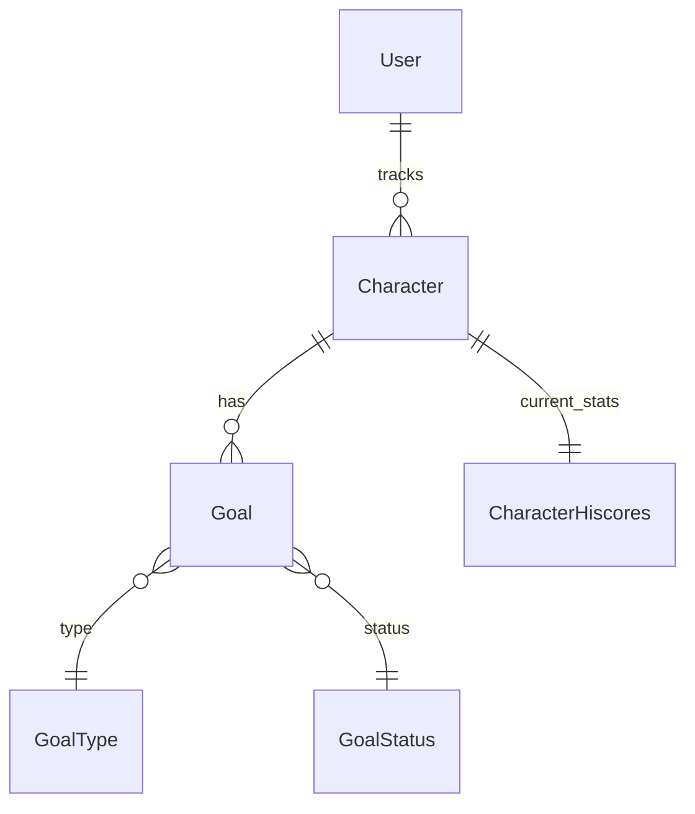

# Data Models

## Overview

The service uses immutable data models with builder patterns, implemented using Lombok annotations. All models follow consistent patterns for serialization and validation.

## Core Models

### User

Represents a user account in the system.

```java
@Value
@Builder
public class User {
    String userId;          // Unique identifier
    String email;          // User's email address
    LocalDateTime createdAt; // Account creation timestamp
    LocalDateTime updatedAt; // Last update timestamp
}
```

### Character

Represents a RuneScape character.

```java
@Value
@Builder
public class Character {
    String name;           // RuneScape display name
    LocalDateTime lastUpdated; // Last stats update
    CharacterHiscores stats; // Current character stats
}
```

### CharacterHiscores

Represents a character's skill levels and experience.

```java
@Value
@Builder
public class CharacterHiscores {
    String playerName;
    Map<String, SkillStats> skills;
    Map<String, ActivityStats> activities;
}

@Value
@Builder
public class SkillStats {
    int rank;
    int level;
    long experience;
}

@Value
@Builder
public class ActivityStats {
    int rank;
    int score;
}
```

### Goal

Represents a player's skill or achievement goal.

```java
@Value
@Builder
public class Goal {
    String goalId;         // Unique identifier
    String userId;         // Associated user
    String playerName;     // Associated character
    GoalType type;        // Type of goal
    String skillName;      // Target skill (if applicable)
    long targetValue;      // Target value
    long currentValue;     // Current progress
    GoalStatus status;     // Current status
    LocalDateTime createdAt;
    LocalDateTime updatedAt;
    LocalDateTime targetDate; // Optional deadline
}

public enum GoalType {
    SKILL_LEVEL,
    SKILL_XP,
    ACTIVITY_SCORE,
    ACTIVITY_RANK
}

public enum GoalStatus {
    IN_PROGRESS,
    COMPLETED,
    ABANDONED
}
```

## Request/Response Models

### CreateUserRequest

```java
@Value
@Builder
public class CreateUserRequest {
    @NotBlank
    @Email
    String email;
}
```

### CreateUserResponse

```java
@Value
@Builder
public class CreateUserResponse {
    String userId;
    String email;
    LocalDateTime createdAt;
}
```

### AddPlayerRequest

```java
@Value
@Builder
public class AddPlayerRequest {
    @NotBlank
    String playerName;
}
```

### CreateGoalRequest

```java
@Value
@Builder
public class CreateGoalRequest {
    @NotBlank
    String playerName;
    
    @NotNull
    GoalType type;
    
    String skillName;
    
    @Min(1)
    long targetValue;
    
    LocalDateTime targetDate;
}
```

## Database Models

### UserEntity

DynamoDB representation of a user.

```java
@DynamoDBTable(tableName = "Users")
public class UserEntity {
    @DynamoDBHashKey
    String userId;
    
    @DynamoDBAttribute
    String email;
    
    @DynamoDBAttribute
    String createdAt;
    
    @DynamoDBAttribute
    String updatedAt;
}
```

### CharacterAssociationEntity

DynamoDB representation of user-character association.

```java
@DynamoDBTable(tableName = "CharacterAssociations")
public class CharacterAssociationEntity {
    @DynamoDBHashKey
    String userId;
    
    @DynamoDBRangeKey
    String playerName;
    
    @DynamoDBAttribute
    String createdAt;
}
```

### GoalEntity

DynamoDB representation of a goal.

```java
@DynamoDBTable(tableName = "Goals")
public class GoalEntity {
    @DynamoDBHashKey
    String goalId;
    
    @DynamoDBAttribute
    String userId;
    
    @DynamoDBAttribute
    String playerName;
    
    @DynamoDBAttribute
    String type;
    
    @DynamoDBAttribute
    String skillName;
    
    @DynamoDBAttribute
    Long targetValue;
    
    @DynamoDBAttribute
    Long currentValue;
    
    @DynamoDBAttribute
    String status;
    
    @DynamoDBAttribute
    String createdAt;
    
    @DynamoDBAttribute
    String updatedAt;
    
    @DynamoDBAttribute
    String targetDate;
}
```

## Model Relationships



## Validation

Models use Jakarta Validation annotations:

```java
public class ValidationGroups {
    public interface Create {}
    public interface Update {}
}

@Value
@Builder
public class Goal {
    @NotNull(groups = Update.class)
    String goalId;
    
    @NotBlank(groups = Create.class)
    String userId;
    
    @NotBlank(groups = Create.class)
    String playerName;
    
    @NotNull(groups = Create.class)
    GoalType type;
    
    @Min(value = 1, groups = {Create.class, Update.class})
    long targetValue;
}
```

## Serialization

Models use Jackson annotations for JSON handling:

```java
@Value
@Builder
@JsonInclude(JsonInclude.Include.NON_NULL)
public class CharacterHiscores {
    @JsonProperty("player_name")
    String playerName;
    
    @JsonFormat(shape = JsonFormat.Shape.OBJECT)
    Map<String, SkillStats> skills;
    
    @JsonFormat(shape = JsonFormat.Shape.OBJECT)
    Map<String, ActivityStats> activities;
}
``` 