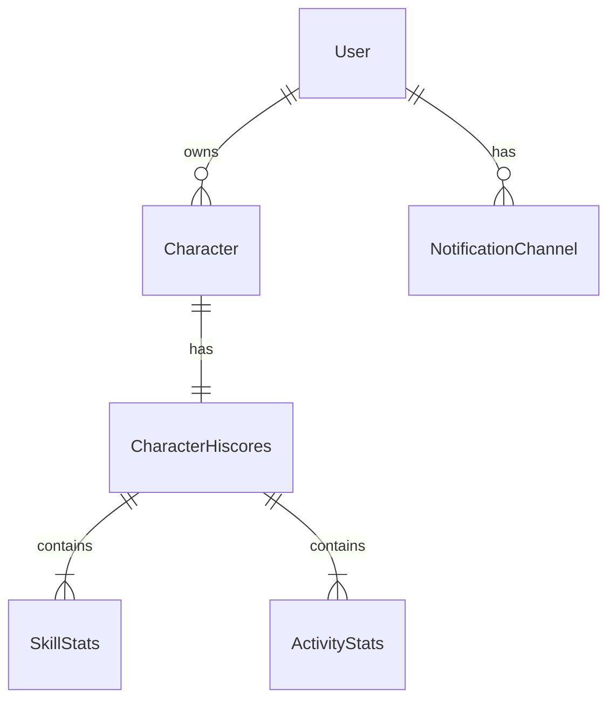

# Data Models

## Overview

All models in the service follow these principles:
- Immutable using Lombok `@Value`
- Builder pattern using Lombok `@Builder`
- Request objects use `@Data` with `@NoArgsConstructor`
- Clear separation between domain models and DTOs
- Validation using Jakarta Validation annotations

## Domain Models

### User Domain

```java
@Value
@Builder
public class User {
    String userId;
    String email;
    LocalDateTime createdAt;
    LocalDateTime updatedAt;
}
```

### Character Domain

```java
@Value
@Builder
public class Character {
    String name;
    LocalDateTime lastUpdated;
    List<Skill> skills;
    List<Activity> activities;
}

@Value
@Builder
public class Skill {
    String name;
    int level;
    long experience;
    int rank;
}

@Value
@Builder
public class Activity {
    String name;
    int score;
    int rank;
}
```

### Hiscore Domain

```java
@Value
@Builder
public class CharacterHiscores {
    String playerName;
    Map<String, SkillStats> skills;
    Map<String, ActivityStats> activities;
    LocalDateTime timestamp;
}

@Value
@Builder
public class SkillStats {
    int rank;
    int level;
    long experience;
}

@Value
@Builder
public class ActivityStats {
    int rank;
    int score;
}
```

### Notification Channel Domain

```java
@Value
@Builder
public class NotificationChannel {
    String userId;
    String channelId;
    String channelType;
    String identifier;
    boolean active;
    LocalDateTime createdAt;
    LocalDateTime updatedAt;
}
```

### Goal
Represents a goal for a character's skill or activity progress.

```java
@Value
@Builder
public class Goal {
    String userId;              // The ID of the user who owns this goal
    String goalId;             // The ID of the goal
    String characterName;      // The name of the character this goal is for
    String targetAttribute;    // The skill or activity being tracked
    String targetType;         // The type of target (e.g., "xp", "level")
    long targetValue;          // The target value to achieve
    Instant targetDate;        // The date by which to achieve the goal
    String notificationChannelType; // The type of notification channel to use
    String frequency;          // How often to check/notify about progress
    Instant createdAt;         // When this goal was created
    Instant updatedAt;         // When this goal was last updated
}
```

Note: The current progress towards a goal is tracked separately from the goal itself, as it represents the dynamic state rather than the goal's configuration.

### Orchestration Events

```java
@Value
@Builder
public class GoalCreationEvent {
    String userId;
    String characterName;
    String targetAttribute;
    String targetType;
    long targetValue;
    long currentValue;
    LocalDate targetDate;
    String notificationChannelType;
    String frequency;
}
```

## Request/Response DTOs

### User Endpoints

```java
@Data
@NoArgsConstructor
public class CreateUserRequest {
    @NotBlank(message = "Email is required")
    @Email(message = "Invalid email format")
    private String email;
}

@Value
@Builder
public class GetUserResponse {
    String userId;
    String email;
    LocalDateTime createdAt;
    LocalDateTime updatedAt;
}
```

### Character Endpoints

```java
@Data
@NoArgsConstructor
public class AddCharacterToUserRequest {
    @NotBlank(message = "Character name is required")
    private String characterName;
}

@Value
@Builder
public class GetCharacterHiscoresResponse {
    String characterName;
    Map<String, SkillStats> skills;
    Map<String, ActivityStats> activities;
    LocalDateTime timestamp;
}
```

### Notification Channel Endpoints

```java
@Data
@NoArgsConstructor
public class CreateNotificationChannelForUserRequest {
    @NotBlank(message = "Channel type is required")
    private String channelType;

    @NotBlank(message = "Identifier is required")
    private String identifier;
    // Note: Notification channels are active by default upon creation
}

@Value
@Builder
public class GetNotificationChannelsForUserResponse {
    List<NotificationChannel> notificationChannels;
}
```

## Database Models

### DynamoDB Entities

```java
@DynamoDBTable(tableName = "Users")
public class UserEntity {
    @DynamoDBHashKey
    private String userId;
    
    @DynamoDBAttribute
    private String email;
    
    @DynamoDBAttribute
    private String createdAt;
    
    @DynamoDBAttribute
    private String updatedAt;
}

@DynamoDBTable(tableName = "Characters")
public class CharacterEntity {
    @DynamoDBHashKey
    private String userId;
    
    @DynamoDBRangeKey
    private String characterName;
    
    @DynamoDBAttribute
    private String lastUpdated;
}

@DynamoDBTable(tableName = "NotificationChannels")
public class NotificationChannelEntity {
    @DynamoDBHashKey
    private String userId;
    
    @DynamoDBRangeKey
    private String channelId;
    
    @DynamoDBAttribute
    private String channelType;
    
    @DynamoDBAttribute
    private String identifier;
    
    @DynamoDBAttribute
    private boolean active;
    
    @DynamoDBAttribute
    private String createdAt;
    
    @DynamoDBAttribute
    private String updatedAt;
}
```

## Model Relationships



## Validation Groups

```java
public class ValidationGroups {
    public interface Create {}
    public interface Update {}
}

@Value
@Builder
public class Character {
    @NotNull(groups = ValidationGroups.Update.class)
    String name;
    
    @NotNull(groups = ValidationGroups.Create.class)
    String userId;
}
```

## JSON Serialization

```java
@Value
@Builder
@JsonInclude(JsonInclude.Include.NON_NULL)
public class CharacterHiscores {
    @JsonProperty("player_name")
    String playerName;
    
    @JsonFormat(shape = JsonFormat.Shape.OBJECT)
    Map<String, SkillStats> skills;
    
    @JsonFormat(pattern = "yyyy-MM-dd'T'HH:mm:ss.SSSZ")
    LocalDateTime timestamp;
}
```

## Model Conversion

Each domain should provide mapper methods for converting between different model representations:

```java
public class UserMapper {
    public static User fromEntity(UserEntity entity) {
        return User.builder()
            .userId(entity.getUserId())
            .email(entity.getEmail())
            .createdAt(parseDateTime(entity.getCreatedAt()))
            .updatedAt(parseDateTime(entity.getUpdatedAt()))
            .build();
    }
    
    public static UserEntity toEntity(User user) {
        UserEntity entity = new UserEntity();
        entity.setUserId(user.getUserId());
        entity.setEmail(user.getEmail());
        entity.setCreatedAt(formatDateTime(user.getCreatedAt()));
        entity.setUpdatedAt(formatDateTime(user.getUpdatedAt()));
        return entity;
    }
}
``` 